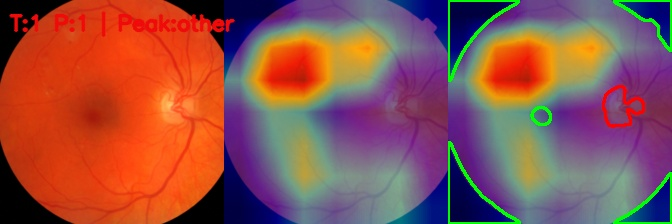
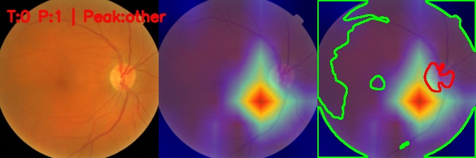
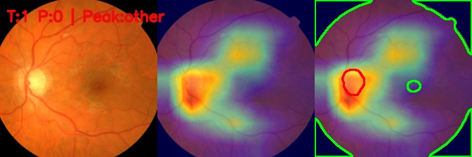

# Diabetic Retinopathy Classification

Deep-learning pipeline for binary diabetic retinopathy classification from retinal fundus images. This project benchmarks CNN and transfer-learning architectures on the Messidor dataset and uses Grad-CAM to examine model attention and failure cases.

> A hands-on course project, privacy-sanitized and standardized for publication as a technical portfolio piece.

## Highlights

- Evaluated **10 model and training configurations** across SimpleCNN, ResNet18, ResNet50, and EfficientNet-B0.
- Compared training from scratch, transfer learning, and full fine-tuning.
- Best model: **fine-tuned EfficientNet-B0**, achieving **0.812 macro-F1**.
- Grad-CAM analysis covered **120 test images**, with **98 correct predictions (81.7%)**.
- Included explicit error analysis for false-positive and false-negative cases.

## Task Definition

The original Messidor retinopathy grades were recategorized into a binary task:

| Original grade | Binary class | Interpretation |
|---|---:|---|
| 0-1 | 0 | No or mild retinopathy |
| 2-3 | 1 | Moderate to severe retinopathy |

## Model Comparison

| Model | Macro-F1 |
|---|---:|
| EfficientNet-B0 Fine-tuning | **0.812** |
| ResNet18 Fine-tuning | 0.769 |
| ResNet50 Fine-tuning | 0.763 |
| ResNet18 Transfer Learning | 0.746 |
| EfficientNet-B0 Transfer Learning | 0.734 |
| ResNet50 Transfer Learning | 0.718 |
| ResNet50 from Scratch | 0.674 |
| ResNet18 from Scratch | 0.605 |
| SimpleCNN | 0.605 |
| EfficientNet-B0 from Scratch | 0.368 |

Full evaluation metrics: [test_performance_results.csv](test_performance_results.csv)

## Grad-CAM Explainability

Each panel shows the original fundus image, the Grad-CAM heatmap, and a structure-aware visualization used to inspect whether the model focused on clinically relevant retinal regions.

### Correct positive prediction

### Misclassification examples

| False positive | False negative |
|---|---|
|  |  |

## Repository Contents

- [diabetic_retinopathy_experiments.ipynb](diabetic_retinopathy_experiments.ipynb) - complete preprocessing, training, evaluation, and Grad-CAM workflow
- [test_performance_results.csv](test_performance_results.csv) - test-set metrics for all model configurations
- Selected Grad-CAM panels - correct and misclassified examples

## Method

1. Load Messidor image annotations.
2. Convert four retinopathy grades into a binary classification target.
3. Resize, crop, normalize, and augment retinal images.
4. Train CNN, ResNet, and EfficientNet architectures.
5. Compare macro-F1, per-class precision, recall, and F1.
6. Interpret the best-performing model with Grad-CAM and analyze errors.

## Tech Stack

Python, PyTorch, Torchvision, pandas, NumPy, scikit-learn, OpenCV, Matplotlib, Seaborn, and Grad-CAM.

## Dataset and Reproducibility

This project uses the Messidor retinal fundus dataset. Raw medical images and model checkpoints are not included because of dataset usage constraints and file size. Obtain the dataset from its official source and place the extracted files under `messidor_dataset/` before running the notebook.

The published notebook has been sanitized to remove private Google Drive links and execution-account metadata.

## Responsible Use

This is an educational machine-learning project, not a clinically validated diagnostic system. Results are specific to the project dataset and test split.
